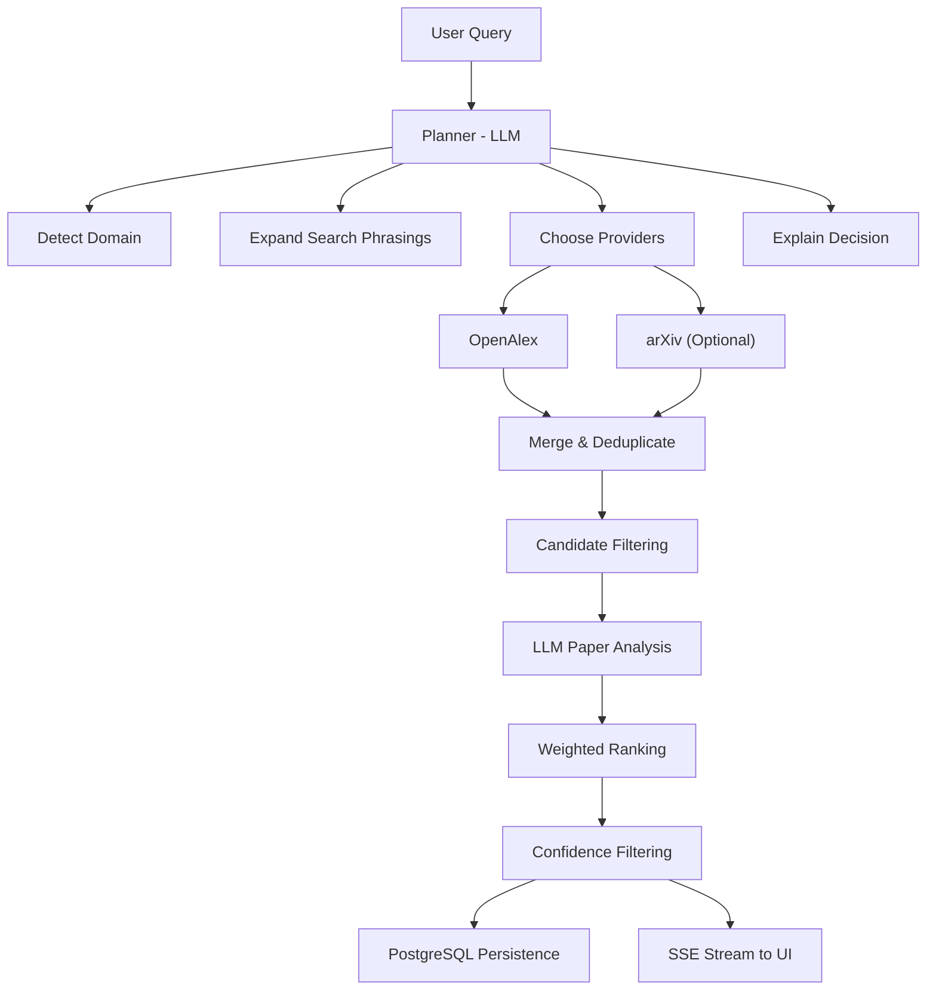
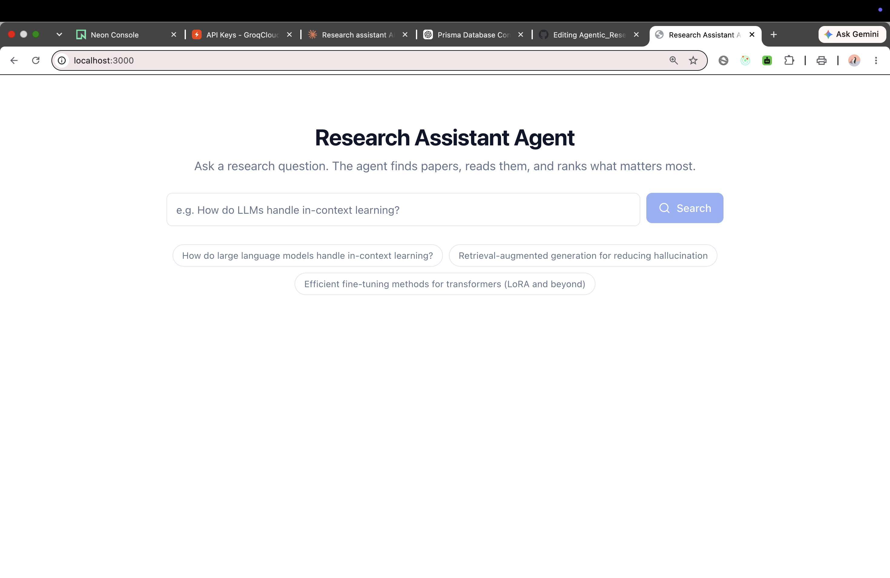
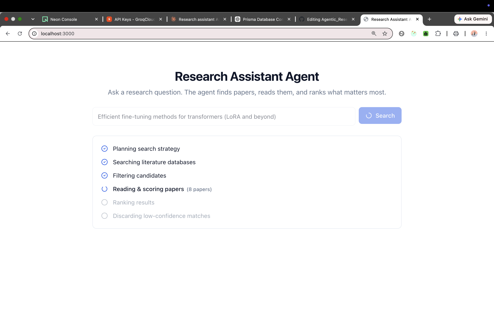
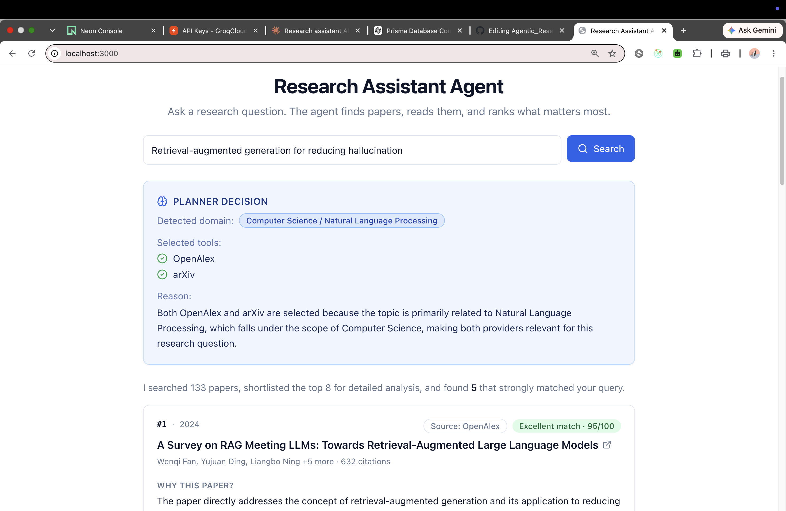

#PAPER-SCOUT: Research Assistant AI Agent

<!--
Live Demo: https://agentic-research-agent-pi.vercel.app/
Architecture: see below
Screenshots: see below
-->

An agent that takes a research question, plans its own search strategy — including
*which academic databases to query* — then autonomously searches, reads and scores
each candidate paper against your specific question using an LLM, and returns a
ranked, explained shortlist. You get told not just *what* to read, but *why* it
matters, and *why the agent looked where it looked*.

## Key Features

- 🧠 **LLM-powered query planner** — expands a loose question into concrete search
  phrasings and detects the research domain before anything is fetched.
- 🔀 **Dynamic tool/provider selection** — the planner chooses OpenAlex, arXiv, or
  both, based on the query's domain, and explains why.
- 📚 **Multi-provider academic search** — OpenAlex (broad, cross-discipline) and
  arXiv (CS/AI/ML/physics/math preprints), merged and deduped.
- 🔍 **Automatic query expansion** — one question becomes several search-engine
  phrasings to widen recall.
- 💰 **Cost-aware candidate filtering** — a cheap relevance+citation+recency
  heuristic trims the pool before the expensive LLM pass.
- ⚡ **Parallel LLM paper analysis** — bounded-concurrency Groq calls score every
  candidate against the *specific* question, not generic similarity.
- 🎯 **Confidence-based ranking & filtering** — papers below a relevance threshold
  are discarded outright, not just ranked low ("4 papers matched," not "8 papers,
  half of them irrelevant").
- 📡 **Real-time pipeline streaming** — Server-Sent Events show each pipeline stage
  as it happens, including the planner's decision and the confidence filter.
- 🗄️ **PostgreSQL caching** — papers are cached globally and reused across queries.

## Agentic Planning

Before searching, the LLM acts as a planner rather than a fixed pipeline stage.
Instead of blindly querying every paper source every time, it:

- **Detects the research domain** (e.g. "Computer Science / Machine Learning" vs.
  "Medicine") from the raw question.
- **Expands the query** into multiple academic search phrasings — these engines do
  keyword/title-driven search, not conversational search, so the phrasings are
  written to read like paper titles or abstract fragments.
- **Selects the most appropriate search providers** — OpenAlex alone for medicine,
  biology, social science, or the humanities; OpenAlex *and* arXiv together for
  AI/ML/CS research, where recent preprints matter and arXiv is often first to have
  them.
- **Explains its routing decision to the user** in plain language, surfaced in the
  UI as a "Planner Decision" panel — so the choice is visible, not implicit.

### Why this is agentic

Unlike a traditional academic search tool that always queries the same fixed
backend, this system first *plans* a search strategy, *chooses* the tools it needs
for that specific query, *explains its reasoning*, and only then *executes* the
search. That plan → tool selection → execution loop — with the routing decision
made by the LLM per-query rather than hardcoded — is what makes this an agent
rather than a wrapper around a single search API.

### Architecture Diagram


## Screenshots

### Home Page

<p align="center">
  
</p>

### Planner Decision

<p align="center">
  
</p>

### Ranked Results

<p align="center">
  
</p>


## Why these design choices (worth saying out loud in an interview)

- **Why a planner at all, instead of always searching everything?** A fixed
  "query every provider every time" pipeline isn't making a decision — it's just
  fan-out. Having the LLM look at the question first and decide *which* providers
  are worth querying (and say why) is what turns this from "a search API wrapper"
  into something demonstrably agentic, and it also avoids wasting a request on a
  provider that will only add noise (e.g. arXiv for a medical query).
- **Why OpenAlex.** No API key required (a `mailto` param just joins a "polite
  pool" for steadier rate limits), broad cross-discipline coverage including
  medicine/biology/social science, and comparable coverage to Semantic Scholar
  without that API's institutional-affiliation key review — a real risk on a short
  timeline. The client is isolated behind a shared `RawPaper` interface, so it was
  a one-file change when a second provider was added later.
- **Why arXiv, and why only sometimes.** arXiv is free, requires no key, and is
  often the *first* place new AI/ML/CS papers appear, months before formal
  publication — valuable for exactly the kind of query this project targets. But
  it's overwhelmingly CS/physics/math/stats, so querying it unconditionally would
  inject irrelevant preprints into medical or social-science searches. Making the
  planner decide, per query, keeps precision high without giving up recall on the
  queries where arXiv actually matters.
- **No embeddings/vector DB.** Running an embedding model inside a serverless
  function has real cold-start/timeout risk on a short build timeline. Instead,
  the LLM itself judges relevance directly against the specific question —
  arguably more "agentic" than cosine similarity, and zero extra infra. The code
  is structured so pgvector could be bolted on later as a pre-filtering step
  before the LLM pass (see **Future Work**).
- **Why weighted ranking, and why relevance dominates (0.65 vs 0.25 for
  citations).** Citation count alone rewards old, famous, often-irrelevant papers
  — a landmark paper in an unrelated subfield will always out-cite a niche but
  genuinely on-topic one. The test suite has an explicit regression test for this:
  a highly-cited-but-off-topic paper must rank below a low-citation-but-on-topic
  one.
- **Why filter candidates before the LLM pass, not after.** Every paper that
  reaches `analyzePapers` costs one Groq call — on a rate-limited free tier, that's
  the actual scaling constraint. `filterCandidates` scores by keyword-overlap
  relevance *first* (not just citations/recency) so the LLM only spends calls on
  papers that are plausibly on-topic, and a cap keeps latency and cost bounded
  regardless of how broad the search is.
- **Why a separate confidence-filtering step, after ranking.** Filtering before
  the LLM pass controls *cost*; filtering after it controls *quality of what the
  user sees*. A paper can survive the cheap pre-filter and still turn out to be
  irrelevant once the LLM actually reads it — the confidence step discards those
  rather than showing a low-relevance result just because it was retrieved. The
  user sees "4 papers matched," not "8 papers, several of which don't really."
- **Why SSE streaming instead of a single blocking request.** The pipeline takes
  10-20s; streaming stage updates (`planning → searching → filtering → analyzing →
  ranking → confidence`) to the frontend avoids a dead spinner and makes each of
  the agent's decisions visible as it happens, including the planner's routing
  choice and the confidence filter doing its work.
- **Papers are cached globally, results per-query.** A paper fetched once from
  either provider is upserted and reused across every future query that surfaces
  it — only the per-query LLM analysis is query-specific and gets re-run.

## Tech stack

| **Layer**         | **Technology**                             | **Purpose**                                                                   |
| ----------------- | ------------------------------------------ | ----------------------------------------------------------------------------- |
| **Frontend**      | Next.js 14 (App Router), React, TypeScript | User interface, Server Components, API routes                                 |
| **Backend**       | Next.js API Routes                         | Agent pipeline orchestration and SSE streaming                                |
| **Database**      | PostgreSQL (Neon)                          | Persist queries, papers, rankings, and search history                         |
| **ORM**           | Prisma                                     | Type-safe database access and schema management                               |
| **LLM**           | Groq (`openai/gpt-oss-120b`)           | Query planning, paper analysis, relevance scoring, structured JSON generation |
| **Paper Sources** | OpenAlex Works API, arXiv Atom API         | Academic paper retrieval with planner-driven provider selection               |
| **Planner**       | LLM-based Query Planner                    | Domain detection, query expansion, and dynamic provider routing               |
| **Styling**       | Tailwind CSS, shadcn/ui                    | Responsive UI and reusable components                                         |
| **Testing**       | Vitest, Playwright                         | Unit testing and end-to-end testing                                           |
| **Deployment**    | Vercel                                     | Serverless deployment and hosting                                             |

## Local setup

**Prerequisites:** Node 18+, a free [Neon](https://console.neon.tech) Postgres database,
a free [Groq](https://console.groq.com/keys) API key.

```bash
npm install
cp .env.example .env
# fill in DATABASE_URL, DIRECT_URL (from Neon), GROQ_API_KEY (from Groq)

npx prisma generate
npx prisma db push        # creates tables from schema.prisma — no migration files needed for this scale

npm run dev                # http://localhost:3000
```

> Neon gives you two connection strings on the dashboard — a pooled one (`-pooler` in
> the hostname) and a direct one. Put the pooled one in `DATABASE_URL` and the direct
> one in `DIRECT_URL`; Prisma uses the direct connection for schema pushes/migrations
> and the pooled one at runtime, which matters on serverless where connection count
> can spike.

arXiv needs no API key or setup at all — it's queried automatically whenever the
planner decides the query's domain calls for it.

### Manual smoke test (before every deploy)

```bash
npm run dev
```
Then in the browser, run a few real queries spanning different domains and
specificity levels, e.g.:
- "retrieval-augmented generation for reducing hallucination" (AI/ML — should route
  to OpenAlex + arXiv)
- "latest treatments for Alzheimer's disease" (medicine — should route to OpenAlex
  only)
- "efficient fine-tuning methods for transformers" (broad — checks filterCandidates
  caps sanely)
- something deliberately obscure (checks the empty-results state renders correctly)

Confirm: agent steps render in order including the confidence-filter stage, the
Planner Decision panel shows a sensible domain/provider choice with no console
errors from `arxiv.ts`, source badges match each paper's actual venue, results are
plausibly relevant, and rationale text actually explains the ranking.

## Deployment (Vercel + Neon)

1. Push this repo to GitHub.
2. In Vercel: **New Project** → import the repo.
3. Add environment variables: `DATABASE_URL`, `DIRECT_URL`, `GROQ_API_KEY`
   (`OPENALEX_MAILTO` is optional but recommended — see .env.example).
4. Deploy. Vercel runs `npm run build`, which runs `prisma generate` first (see
   `package.json`), then `next build`.
5. After first deploy, run `npx prisma db push` locally against the **production**
   `DATABASE_URL` once to create tables in prod (or wire it into a release step).
6. Smoke-test the deployed URL with the same manual checklist above.

Note on Vercel's Hobby plan: serverless functions cap at 60s execution time, which
is why `maxDuration = 60` is set on `/api/search`. Worth watching now that a search
can sequentially hit two external APIs (OpenAlex and arXiv) instead of one when the
planner selects both — comfortably inside the window for typical queries, but worth
re-checking if `filterCandidates`'s candidate cap is ever raised.

## Future work

- **pgvector-backed pre-filtering.** Add an embeddings pass (e.g. via a Groq or
  Cohere embeddings endpoint, avoiding in-process model weights entirely) to do a
  cheap semantic pre-filter *before* the LLM relevance pass, so `filterCandidates`
  becomes semantic instead of keyword-overlap-based. The pipeline is already
  staged so this slots in as a new step 3.5 without touching steps 1-2 or 4-6.
- **CrossRef integration** — DOI resolution and metadata enrichment, and another
  domain the planner could route to.
- **PubMed integration** — dedicated medical-literature coverage, likely a better
  fit than OpenAlex alone for clinical/biomedical queries specifically.
- **Semantic Scholar integration** — as a third general-purpose provider option
  once its API key review is in hand; would give the planner a real three-way
  choice instead of two.
- **PDF ingestion** — let a user upload a PDF directly and have the agent analyze
  it against a question, instead of only searching external indexes.
- **Citation graph exploration** — "show me what this paper cites" / "show me
  what cites this paper" as a follow-up action on any ranked result.
- **Saved research collections** — user accounts + the ability to save/organize
  results across multiple queries, rather than anonymous per-query rows.
- **Feedback loop** — let users mark a result as irrelevant, feed that back into
  future `planQuery` prompts for the same user.

## About the Project

- Built an agentic research assistant that uses an LLM planner to dynamically
  choose academic search providers (OpenAlex and arXiv) before retrieving,
  analyzing, and ranking research papers — reducing literature-discovery time from
  hours to seconds.
- Designed a planner-driven dynamic multi-provider search pipeline (domain
  detection → query expansion → provider selection → cost-aware candidate
  filtering → parallel LLM analysis → weighted ranking → confidence-based
  filtering), with bounded-concurrency LLM calls and exponential-backoff retry
  logic across two external APIs.
- Implemented a weighted relevance-ranking algorithm combining LLM-judged
  relevance, log-scaled citation impact, and recency, validated with unit tests
  including a regression test proving the ranker favors on-topic papers over
  merely-famous ones.
- Added a confidence-threshold filtering stage so the agent discards low-relevance
  results rather than merely ranking them low — the UI reports "4 papers matched
  your query" instead of "8 papers, several tangentially related."
- Streamed real-time agent-execution progress to the frontend via Server-Sent
  Events — including the planner's routing decision and reasoning — and wrote a
  Vitest suite plus a mocked-network Playwright E2E suite covering the full search
  flow, error states, and empty-result states.